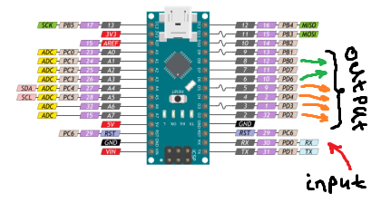

# arduino-osa103Mini-bandpassFilters
    <h1>Osa103Mini, Arduino, полосовые фильтры</h1>
    
    <h3>Источники</h3>
    <h3>Описание работы</h3>
    
Исходный код взял с форума. Сообщение 127. Переделал под себя, используется порт RX для приёма данных по СОМ UART с выхода AUX OUTPUT(на скорости 1М, точное описание в форуме от создателя прибора)

    
Описание протокола обмена данных 4 байта от младшего к старшему, 5ый байт что передача(0х80), нетт передачи(0х00)

    
В разработке переключения фильтров использовал Arduino Nano, для обработки данных. Любой AVR  подойдёт с условием обработки данных на скорости СОМ 1М

    
RX input вход, D2 D3 D4 D5 D6 D8 output выход. Фильтры актавные 0-4МГЦ, 4-8МГЦ, 8-16МГЦ, 16-32МГЦ. и два выхода на светодиодики(частота >32МГц, передача). 

    
Пины использовал RX для приёма данных, D2 - фильтр на 0-4МГц, D3 - фильтр на 4 - 8МГц, D4 - фильтр на 8-16 МГц, D5 - фильтр на 16-32МГц, D6 - уже не фильтр, а игнал что частота дольше 32МГц, D8 - сигнал что идёт передача 

    
    <h3>P.S. Ошибки, недочёты</h3>
    
Тестировали на программе HDSDR, при переходе между фильтрами есть ошибка при установке частоты, которая увеличивается. Т.е. переключение происходит не на частоте которая используется, а с недольшой разбежкой. которая увеличивается постепенно.

    
Использовалась в коде коректировка частоты, но не помогает так как ошибка возрастает.

    <h3>Лицензия</h3>
    
Используйте как хотите. В любом коде могут быть ошибки... Сам не разработчик железок.
